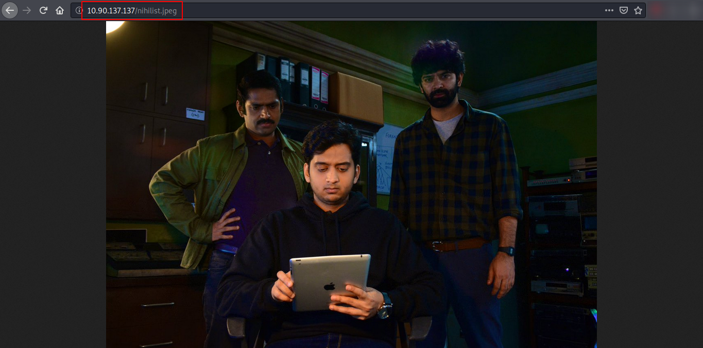
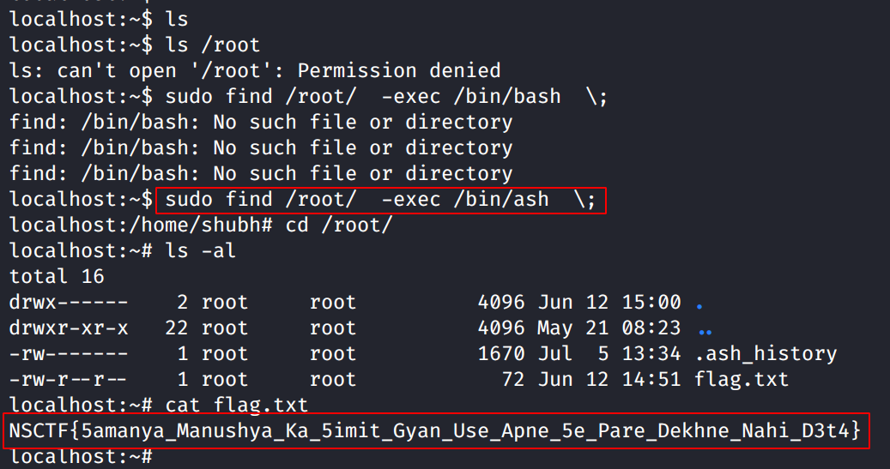

# Writeup for CTFFriday 2020 July W1 by Muzkkir

In this article, I’m going to explain solutions of NSCTF July Week 1, 2020 CTF challenge theme "Asur" Organized by Net-Square Solutions Pvt. Ltd. and created by Prachi Karad.

This CTF had Five different challenges in which major 4 domain was covered; Stenography, Cryptography, Privilege Escalation, and Web challenges. We have to start from Stenography and Cryptography exploitation to access the system and Privilege Escalation to read the flag file.

<kbd></kbd>

## First Flag

<kbd></kbd>

As the challenge was about looking for the "MASK" on the webpage. I visit the source code page and found that.

<kbd></kbd>

<kbd></kbd>

Firstly, I have download all images and try to use the Steghide tool to extract data.

<kbd></kbd>

I use the Binwalk tool to extract data from the images. I got extracted files from the "mask.jpg"

<kbd></kbd>

```
binwalk -B mask.jpg 
binwalk --dd='.*' mask.jpg
```
by using that command I can able to extract the hidden files from image. 

<kbd></kbd>

Bingo !!! I got my 1st Flag !!!

<kbd></kbd>

```
NSCTF{Andhakar_Ek_5ach_Hai_Aur_Prakash_3k_Mithya}
```

<kbd></kbd>


## Second Flag

<kbd></kbd>

Now, I need to look for the "nihilist" image.

<kbd></kbd>

Using strings command I extracted words from image "nihilist.jpeg". I used -n query to extract word length more than 9
```
strings nihilist.jpeg -n 9
```
<kbd></kbd>

```
74 47 47 82 73 49 72 64 66 45 83 48 86 47 64 46 64 68 56 57 48 46 84 65 73 75 45 43 55 49 72 47 65
Ask nikhil to open the door
```
I have retrieved the 2 important hints. Which the first one might be encoding and the second would be the key to extract the flag.

<kbd></kbd>

I visit the "https://cryptii.com/" website to decode the ASCII code. Look at the Library !! I found the encoding method.

<kbd></kbd>

> Now Time to Extract the Flag

<kbd></kbd>

```"flag{karunahikrurtahailagaavhipeedahai}"```


## Third Flag

<kbd></kbd>

As the HINT suggests So I started looking for a "dj" word.
However, most of the attempts are failed at first.

<kbd></kbd>

<kbd></kbd>

<kbd></kbd>

<kbd></kbd>

<kbd></kbd>

> I looked for every possibility. :( but did not found anything useful. Then I got the message!

<kbd></kbd>

I have started looking for "CWE 22" and it is a path traversal vulnerability.

<kbd></kbd>

```So, I went to "http://10.90.137.137/?dj=/etc/passwd"```

<kbd></kbd>

I visit the home folder of Asur and the response was hidden.

<kbd></kbd>

But I found on the source page.

```NSCTF{Peeda_5e_Bada_Sh1kshak_Aur_koi_nahi_Hota}```

<kbd></kbd>


## Fourth Flag

<kbd></kbd>

<kbd></kbd>

I quickly visit the Asur's command history file.

<kbd></kbd>

<kbd></kbd>

```asur:b8be16afba8c314ad33d812f22a04991b90e2aaa```
As per my assumptions, this must be the SSH login credentials but the password was hash format. For hash value to decode I use an online platform named CrackStation where I got the real value of the hash file.
```baconandcheese```

<kbd></kbd>

It's time for Login with SSH !! but what !! I face an error!

<kbd></kbd>

Now I visit the "passwd" file in which I tried all other users with the same credentials.

<kbd></kbd>

listing the directory files for the flag.

```
NSCTF{ATTR_TATTRA_SARVATRA}
```

<kbd></kbd>


## Fifth Flag

<kbd></kbd>

Task is about Privilege Escalation so first I have to look for simple methods.

<kbd></kbd>

Interestingly, I can only use the find command as a superuser.
So, I research on the web about the "find" command to get superuser privilege on the web.

<kbd></kbd>

> & Finally found something useful on "https://www.andreafortuna.org/2018/05/16/exploiting-sudo-for-linux-privilege-escalation/" Domain.

<kbd></kbd>

I have run some commands to see the possibilities. Below is the result.
```
localhost:/home/asur$ sudo find . -exec /bin/bash \;
find: /bin/bash: No such file or directory
find: /bin/bash: No such file or directory
find: /bin/bash: No such file or directory
localhost:/home/asur$ sudo find ../asur/.flag.txt  -exec /bin/bash \;
find: /bin/bash: No such file or directory
localhost:/home/asur$ sudo find ../asur/.flag.txt  -exec /bin/ash  \;
localhost:/home/asur# 
```
From that I sure that, This will work.

<kbd></kbd>

Gotcha !!!
```NSCTF{5amanya_Manushya_Ka_5imit_Gyan_Use_Apne_5e_Pare_Dekhne_Nahi_D3t4}```


## Conclusion


Overall, this CTF was unique for me because I learned about new techniques to Escalate my privileges, as I didn't expect that "find" command can be used for escalation, and cryptography, Stegniography was good for practice. Also, playing this was fun and I appreciate the efforts of the team.


#

**Thank you.**

**Husseni Muzkkir.**
